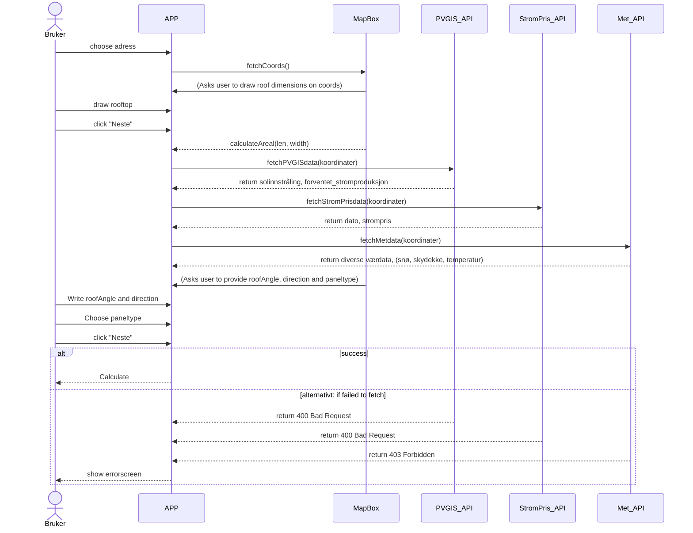

```mermaid

sequenceDiagram

    actor Bruker
    participant APP
    participant MapBox
    participant PVGIS_API
    participant StromPris_API
    participant Met_API

    Bruker ->> APP: choose adress
    APP ->> MapBox: fetchCoords()
    MapBox ->> APP: (Asks user to draw roof dimensions on coords)

    Bruker ->> APP: draw rooftop
    Bruker ->> APP: click "Neste"

    MapBox -->> APP: calculateAreal(len, width)

    APP ->> PVGIS_API: fetchPVGISdata(koordinater)
    PVGIS_API -->> APP: return solinnstråling, forventet_stromproduksjon

    APP ->> StromPris_API: fetchStromPrisdata(koordinater)
    StromPris_API -->> APP: return dato, strompris

    APP ->> Met_API: fetchMetdata(koordinater)
    Met_API -->> APP: return diverse værdata, (snø, skydekke, temperatur)

    MapBox ->> APP: (Asks user to provide roofAngle, direction and paneltype)

    Bruker ->> APP: Write roofAngle and direction
    Bruker ->> APP: Choose paneltype
    Bruker ->> APP: click "Neste"

    

    alt success
        APP -->> Bruker: Calculate

    else alternativt: if failed to fetch

        PVGIS_API -->> APP: return 400 Bad Request

        StromPris_API -->> APP: return 400 Bad Request

        Met_API -->> APP: return 403 Forbidden

        APP -->> Bruker: show errorscreen

    end


```